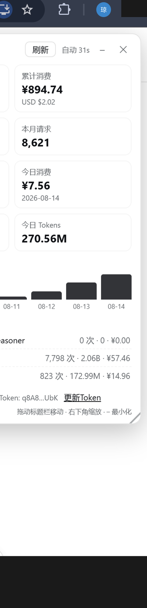

# DeepSeek 用量监控面板 / DeepSeek Usage Monitor

[English](#english) | [中文](#chinese)

为 DeepSeek Harness (DSH) 编写的动态 Cordis 插件：在 Web GUI 中以悬浮全局面板实时展示 DeepSeek 开放平台的用量信息。
A dynamic Cordis plugin for DeepSeek Harness (DSH): a floating global panel showing realtime usage of the DeepSeek Open Platform.

数据直接来自 platform.deepseek.com 的私有 Web API，与官方「用量信息」页面**同源同口径**，非页面解析。
Data comes directly from the private Web APIs of platform.deepseek.com — **same source and same numbers as the official Usage page**. No page scraping.

## 截图 / Screenshot



---

## 功能 / Features

- 充值余额 / 累计消费（CNY + USD）
  Recharge balance / total cost (CNY + USD)
- 本月消费 / 请求次数 / Tokens，按模型分布（deepseek-v4-pro / v4-flash / chat & reasoner）
  Monthly cost / requests / tokens with per-model breakdown
- 今日消费 / 请求次数 / Tokens（小时级实时，与官方页面一致）
  Today's cost / requests / tokens (hourly realtime, identical to the official page)
- 近 7 天消费柱状图 / last-7-days cost bar chart
- 面板可拖动、缩放、最小化为胶囊，位置/大小记忆（localStorage）
  Draggable / resizable / minimizable panel with position & size memory (localStorage)
- 侧边栏底部快捷开关按钮 / sidebar footer toggle button
- Token 过期时面板内直接粘贴更新 / inline token update when expired
- 60s 数据轮询 + 30s 界面刷新 / 60s polling + 30s UI refresh + manual refresh
- 失败自动重试并保留上次数据 / auto retry with last-good-data fallback

## 安装 / Installation

插件是 DSH 的动态 Cordis 插件（会话级，进程内运行）。
It is a session-scoped dynamic Cordis plugin, running inside the DSH process.

1. 在 DSH 会话中通过 `cordis_define` 定义（`plugin.host` 用 `plugin/host.js`，`plugin.client` 用 `plugin/client.js`），然后 `cordis_run` 激活。
   Define via `cordis_define` in a DSH session (`plugin/host.js` for host, `plugin/client.js` for client), then activate with `cordis_run`.
2. 激活后右侧出现悬浮面板；点击「更新Token」粘贴你的 userToken 即可。
   After activation a floating panel appears on the right; click "更新Token" and paste your userToken.

> 动态插件随 DSH 会话存在，进程重启后需重新定义运行。
> Dynamic plugins live with the DSH session; re-define after a process restart.

## 获取 userToken / Getting userToken

userToken 是 platform.deepseek.com 的 Web 登录态（localStorage 存储），用于访问私有 API。
It is the Web login token stored in localStorage, used to call the private APIs.

方式一：浏览器手动
Option 1: manually from browser
1. 登录 platform.deepseek.com
2. F12 → Application → Local Storage → `https://platform.deepseek.com`
3. 复制键 `userToken` 的值（JSON 的 `value` 字段）

方式二：脚本自动（Windows + Chrome）
Option 2: script (Windows + Chrome)

```bash
npm install leveldown   # only needed by the script
node scripts/extract_token.js
```

原理：新版 Chrome 的 Cookie 数据库有 App-Bound 加密无法外部读取，但 localStorage 的 leveldb 可读（snappy 压缩，用 leveldown 解析）。
Why: modern Chrome Cookie DB uses App-Bound encryption and cannot be read externally, but the localStorage leveldb is readable (snappy-compressed, parsed via leveldown).

## 私有 API 协议 / Private API protocol

详见 / See [docs/protocol.md](docs/protocol.md)。

核心接口（`Authorization: Bearer <userToken>`）Core endpoints:

| 接口 Endpoint | 用途 Purpose |
|---|---|
| `GET /api/v0/users/get_user_summary` | 余额 / 累计消费 balance & total cost |
| `GET /api/v0/usage/by_api_key/amount?start=&end=&tz=` | 用量分桶 usage buckets（天级/小时级 day/hour） |
| `GET /api/v0/usage/by_api_key/cost?start=&end=&tz=` | 消费分桶 cost buckets（同上 same） |

时间参数为 GMT+8 秒级时间戳，`tz=28800`；范围 > 1 天自动按天分桶，单日按小时分桶（实时）。
Timestamps are GMT+8 epoch seconds, `tz=28800`; ranges > 1 day are bucketed daily, a single day is bucketed hourly (realtime).

## 免责声明 / Disclaimer

- 私有 Web API，非官方公开接口，可能随时变更；仅用于自己账号的用量监控。
  These are private Web APIs, not official public endpoints, and may change anytime; use only for monitoring your own account.
- 本项目与 DeepSeek 官方无任何关联。
  This project is not affiliated with DeepSeek.

## 致谢 / Credits

接口协议参考了 [CodexBar](https://github.com/steipete/CodexBar) 与 [deepseek-usage-monitor](https://github.com/Shiorangerin/deepseek-usage-monitor) 的逆向成果，并进一步通过浏览器抓包确认了官方页面同源的 `by_api_key` 实时接口。
Protocol reverse-engineered with reference to [CodexBar](https://github.com/steipete/CodexBar) and [deepseek-usage-monitor](https://github.com/Shiorangerin/deepseek-usage-monitor); the same-source `by_api_key` realtime endpoints were confirmed via browser traffic capture.

## License

MIT
